# Deploying Merge Bot with NixOS Anywhere

Merge Bot automates the process of merging pull requests (PRs) after a test suite has successfully completed. This document guides you through deploying Merge Bot using [NixOS Anywhere](https://github.com/nix-community/nixos-anywhere), a comprehensive server installation tool that formats disks and deploys services seamlessly.

## Prerequisites

Before starting the deployment, ensure you have:
- A server with SSH and root access.

## Supported Hosting Providers

By default, NixOS Anywhere supports deploying on the following providers:
- Hetzner Cloud
- Hetzner Cloud AARCH64

To add support for additional hosting providers, modify the [flake.nix](flake.nix) file. This file contains configuration details specific to NixOS, allowing you to extend functionality and customize deployments. 

## Deployment Steps

1. **Server Setup**: Initialize your server with SSH and root access. This step is crucial for the deployment process and varies depending on your hosting provider.

2. Execute `nix develop` to download all dependencies needed for remote deployment

3. Go to the settings page in your organisation 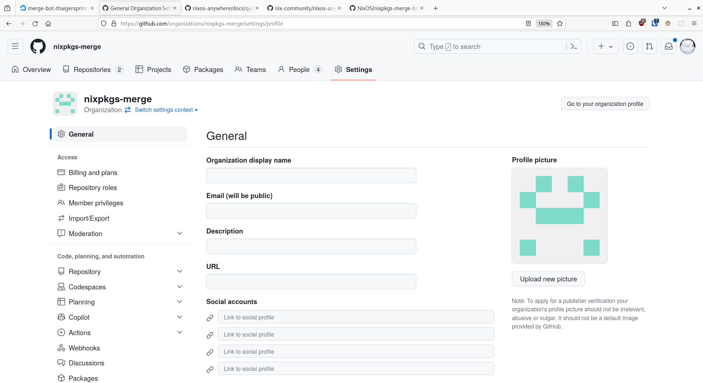

4. Scroll down to developer settings and click on GitHub App 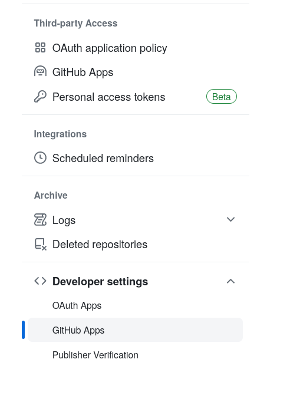

5. Click on new Github app 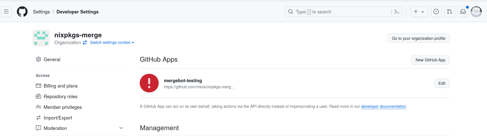
6. Insert a webhook url and a homepage. 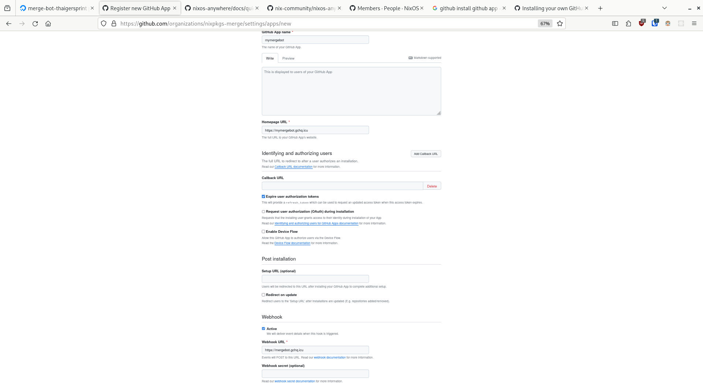
7. Click on create app 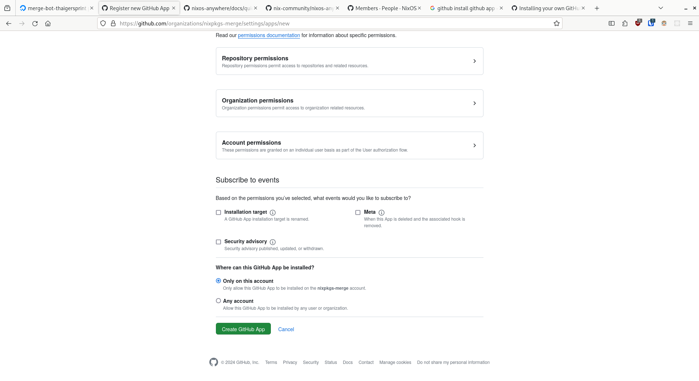
8. Add Webhook Secret 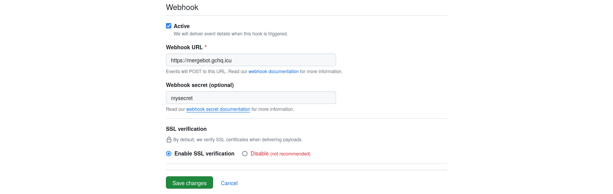
9. Generate a private key  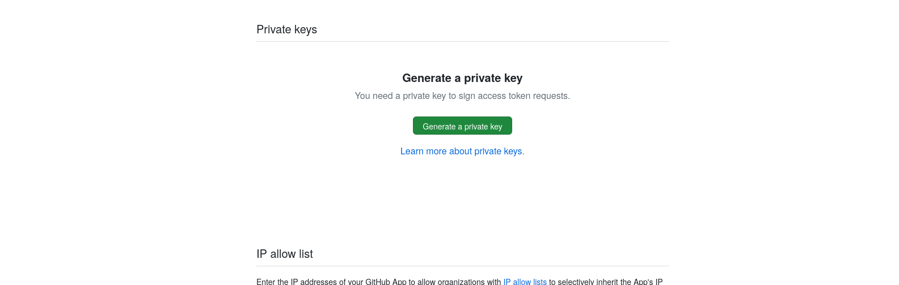
10. Add permissions 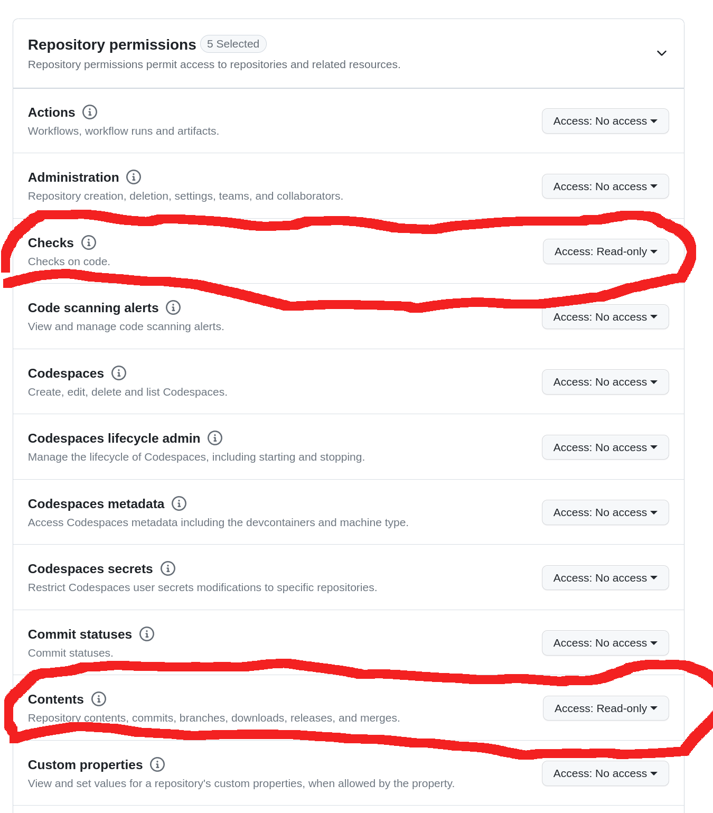
11. Add permissions 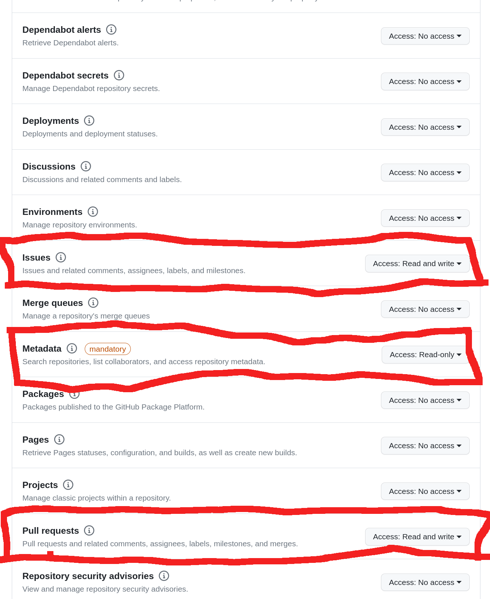
12. Add the events check suite, issue comment, pull request review comment 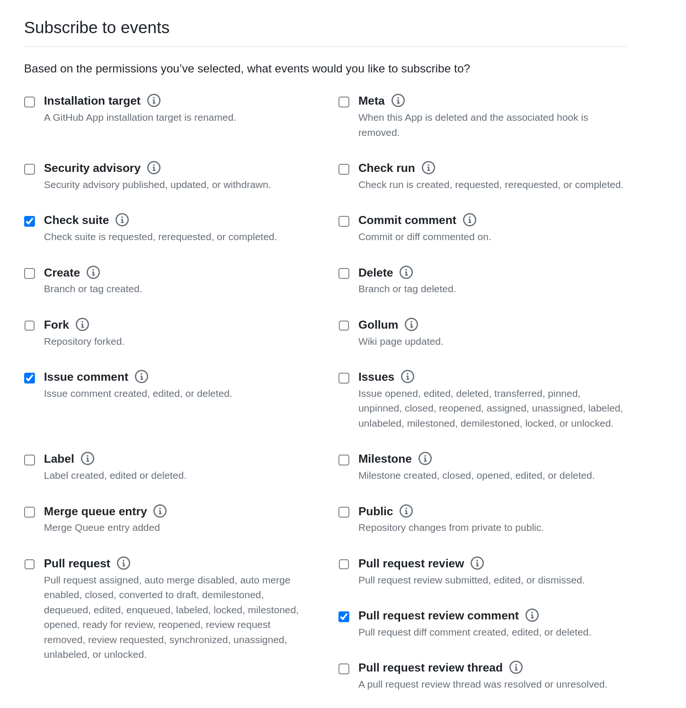
13. Click on install app 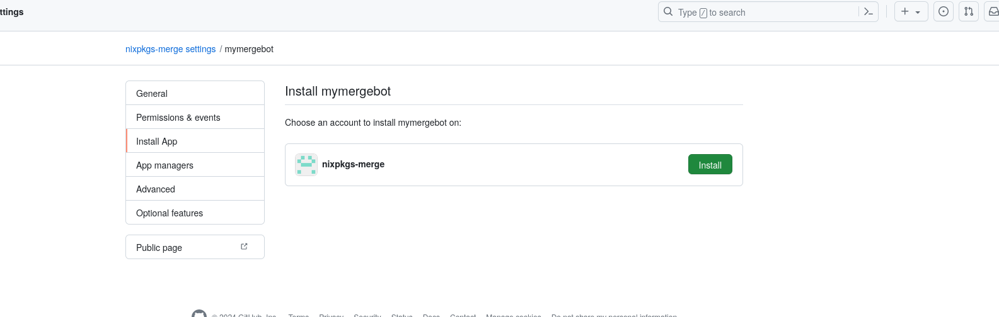
## After Deployment

